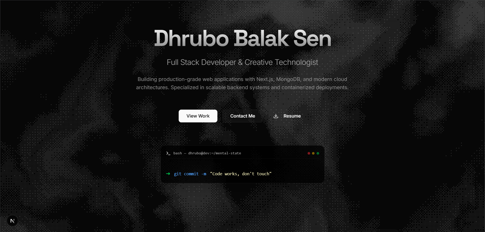

# 🚀 Dhrubo's Portfolio (System v2.0)

> *“Code works, don't touch.”*

A highly interactive, personality-driven developer portfolio built with **Next.js**, **Shadcn UI**, and a healthy dose of chaos engineering (jokes). This isn't just a resume; it's a simulated terminal environment with hidden easter eggs and developer humor.



## 🛠️ Tech Stack

-   **Framework**: [Next.js 15](https://nextjs.org/) (App Router)
-   **Styling**: [Tailwind CSS](https://tailwindcss.com/) & [Shadcn UI](https://ui.shadcn.com/)
-   **Animations**: [Framer Motion](https://www.framer.com/motion/)
-   **3D Effects**: [Three.js](https://threejs.org/) & [React Three Fiber](https://docs.pmnd.rs/react-three-fiber)
-   **Typography**: `Space Grotesk` (Headings) + `Inter` (Body)
-   **Package Manager**: `npm` / `bun`

---

## ⚡ Key Quirks & Features

This portfolio is packed with interactive "developer personality" modules:

### 1. 🖥️ Interactive Terminal Footer
A fully functional CLI at the bottom of the page.
-   **Try commands**: `help`, `ls`, `whoami`, `contact`, `sudo`, `rm -rf /`
-   **Auto-scroll**: Keeps history like a real terminal.

### 2. 📊 System Monitor Widget
A dashboard widget in the "Stack" section tracking:
-   **CPU Usage**: Randomly fluctuating (because Chrome is open).
-   **Coffee Levels**: Slowly depleting bar.
-   **Stack Overflow**: Status check (Ctrl+C / Ctrl+V active).

### 3. 💣 "Deploy to Production" Button
Located in the **Danger Zone** (Contact section).
-   **Warning**: Do not click unless you are ready for a critical system failure.
-   **Effect**: Simulates a production deployment that inevitably crashes into a **BSOD**.

### 4. 🕵️ "Honest Work" Mode
A toggle in the **Experience** section.
-   **Professional Mode**: Standard resume descriptions.
-   **Honest Mode**: The *real* story behind the code (e.g., *"Googled how to center a div"*).

### 5. 🎮 Gamer/Dev Stats
Hover over any **Project Card** to reveal hidden stats:
-   Commits pushed
-   Caffeine consumed
-   Bugs created (known & unknown)

### 6. ⬆️⬆️⬇️⬇️⬅️➡️⬅️➡️ B A (Konami Code)
Type the classic Konami Code on your keyboard to unlock **God Mode**.

---

## 🏃‍♂️ Getting Started

1.  **Clone the repository**:
    ```bash
    git clone https://github.com/DhruboBalakSen/dhrubo.git
    cd dhrubo
    ```

2.  **Install dependencies**:
    ```bash
    npm install
    # or
    bun install
    ```

3.  **Run the development server**:
    ```bash
    npm run dev
    # or
    bun run dev
    ```

4.  Open [http://localhost:3000](http://localhost:3000) with your browser.

---

## 📄 License

This project is open source and available under the [MIT License](LICENSE).

---

*"It works on my machine."* — Dhrubo
